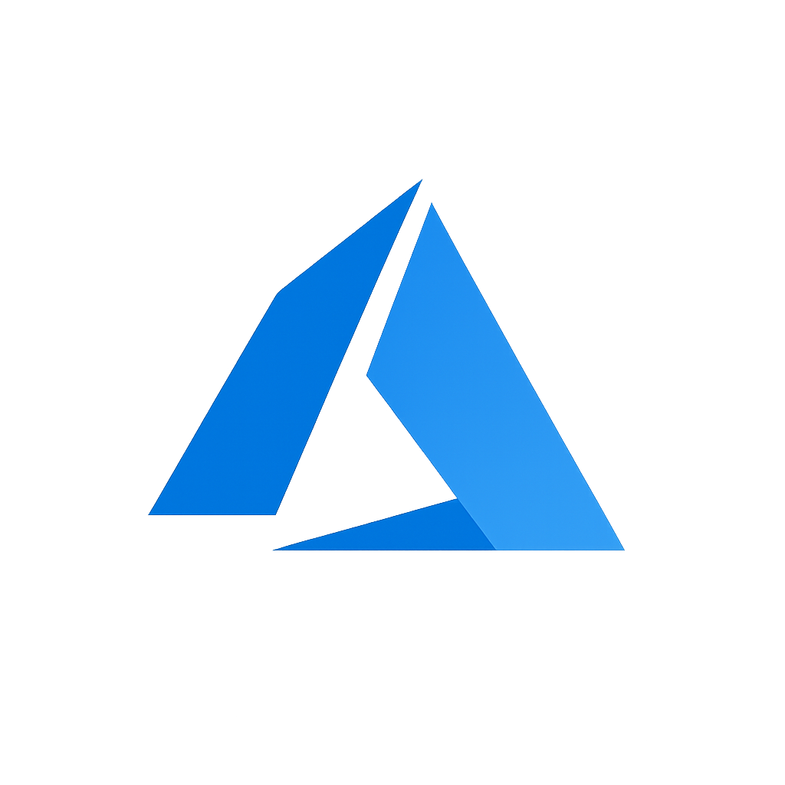

# ⚡ QUICK DEPLOYMENT GUIDE

## 🎯 What You Need to Do

### Step 1: Download Files
Download these 3 files from the outputs folder:
1. ✅ `index.html`
2. ✅ `style.css`
3. ✅ `script.js`

### Step 2: Upload to GitHub

#### Option A: GitHub Web Interface
```
1. Go to your repository:
   https://github.com/Harsha260299/Harshavardhan.portfolio.github.io

2. Click on "index.html" → Click "Edit" (pencil icon)
3. Delete all content
4. Copy-paste from new index.html
5. Commit changes

6. Click on "style.css" → Click "Edit" (pencil icon)
7. Delete all content
8. Copy-paste from new style.css
9. Commit changes

10. Wait 2 minutes for GitHub Pages to rebuild
11. Visit your site and hard refresh (Ctrl+Shift+R)
```

#### Option B: Git Command Line
```bash
# In your local repository folder:

# 1. Replace files
cp /path/to/downloaded/index.html .
cp /path/to/downloaded/style.css .

# 2. Commit changes
git add index.html style.css
git commit -m "Fix: Optimize image resolution and rendering"

# 3. Push to GitHub
git push origin main

# 4. Wait 1-2 minutes for deployment
# 5. Hard refresh your browser
```

### Step 3: Verify

1. Open your portfolio: `https://harsha260299.github.io/Harshavardhan.portfolio.github.io/`
2. Hard refresh: **Ctrl+Shift+R** (Windows) or **Cmd+Shift+R** (Mac)
3. Check AWS logo - should be **crisp and sharp**
4. Check Azure logo - should be **crisp and sharp**
5. Check profile photo - should be **clear and professional**

## 🔍 Before/After Comparison

### ❌ Before (Current):
- Blurry AWS/Azure logos
- Pixelated brand icons
- Page jumps when images load
- Slow initial rendering

### ✅ After (New Files):
- **Crystal clear logos**
- **Sharp brand icons**
- **Stable layout (no jumps)**
- **Faster loading**

## 📊 What Was Changed

### index.html:
```diff
- 
+ 

- 
+ 

- 
+ 
```

### style.css:
```diff
+ /* IMAGE OPTIMIZATION - RESOLUTION FIX */
+ img {
+     image-rendering: -webkit-optimize-contrast;
+     image-rendering: crisp-edges;
+     ...
+ }
+
+ .skill-icon img {
+     width: 100%;
+     height: 100%;
+     object-fit: contain;
+     padding: 10px;
+     image-rendering: crisp-edges;
+     ...
+ }
```

## ⏱️ Estimated Time

- **Download files:** 1 minute
- **Upload to GitHub:** 3 minutes
- **GitHub Pages rebuild:** 2 minutes
- **Testing:** 2 minutes

**Total:** ~8 minutes

## ✅ Success Checklist

After deployment, these should be true:

- [ ] AWS logo is sharp (not blurry)
- [ ] Azure logo is sharp (not blurry)
- [ ] Profile photo looks clear
- [ ] Data/Operations/Soft Skills/Tools icons are crisp
- [ ] Page doesn't jump when scrolling
- [ ] Images load smoothly
- [ ] Site works on mobile

## 🆘 Troubleshooting

### Images Still Blurry?
1. **Hard refresh:** Ctrl+Shift+R (very important!)
2. **Clear cache:** Chrome → Settings → Clear browsing data
3. **Try incognito:** Open site in incognito window
4. **Check deployment:** Verify files were uploaded correctly

### Layout Jumping?
1. Check width/height attributes are in HTML
2. Verify images exist in assets/ folder
3. Open browser console (F12) - check for errors

### Files Not Uploading?
1. Make sure you're editing the correct repository
2. Check you have write permissions
3. Try GitHub Desktop app instead

## 🎯 Quick Test

After deploying, do this test:

```
1. Open your site
2. Right-click on AWS logo
3. Choose "Inspect" or "Inspect Element"
4. In the Styles panel, you should see:
   
   .skill-icon img {
       image-rendering: crisp-edges;
       object-fit: contain;
       padding: 10px;
   }

5. The logo should look sharp in the browser
```

## 📱 Mobile Test

1. Open site on phone
2. Check AWS/Azure logos
3. Should be crisp even on high-resolution displays
4. Pinch to zoom - quality maintained

## 🚀 You're Done!

Once you see sharp, clear images:
✨ Your portfolio looks professional  
✨ Images load efficiently  
✨ Works on all devices  
✨ Ready to impress recruiters!

---

**Need the detailed guide?** Check `IMAGE_RESOLUTION_FIX_GUIDE.md` for technical details.

**Questions?** The fix is simple: just replace 2 files (HTML + CSS) and your images will be perfect! 🎉
